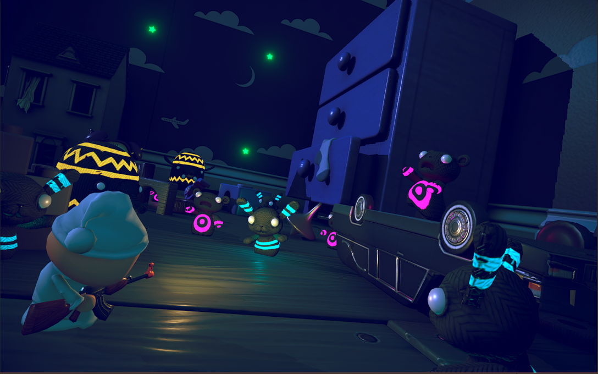
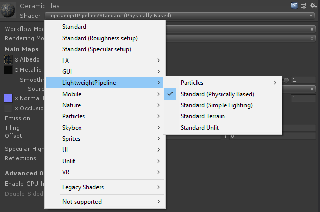
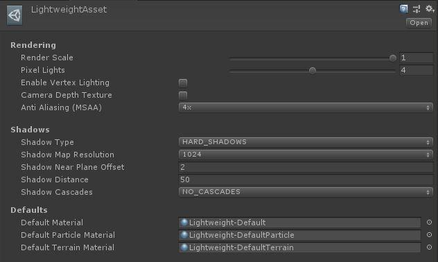

# Lightweight Pipeline

The Lightweight Pipeline is a Scriptable Render Pipeline available with Unity 2018.1. The LT pipe performs a single-pass forward rendering with light culling per-object with the advantage that all lights are shaded in a single pass. Compared to the vanilla unity forward rendering, which performs and additional pass per pixel light, using the LT pipeline will result in less draw calls at the expense of slightly extra shader complexity.

The pipeline supports at most 8 lights per-object and only supports a subset of vanilla Unity  rendering features. A feature comparison table of Lightweight Pipeline vs stock Unity pipeline can be found [here](https://docs.google.com/document/d/1MgoycUhS9xQKXxbTy1yHt7OCByI10rds3TyRBCSlFmg/).

## Lightweight Sample Project

We are providing a Lightweight Pipeline sample project that can be downloaded [here](https://drive.google.com/file/d/1i0GlWYO0SRwauqu3U2rKoUAPO8BOFXw8/). The project is already setup to render properly Lightweight Pipeline so you can easily experiment developing with the Lightweight Pipeline workflow. It comes with a modified nightmares sample scene. 

Nightmares modified scene rendering with Lightweight Pipeline

## How to use Lightweight Pipeline

The Lightweight Pipeline does not work with the Unity stock lit shaders. We have developed a new set of Standard shaders that are located under Lightweight Pipeline group in the material’s shader selection dropdown.

Lightweight Pipeline shaders

**Standard (Physically Based):** Single shader with both Metallic and Specular workflows. Light model similar and upgradable from stock Unity standard shaders. BRDF: Lambertian Diffuse + Simplified Cook Torrance (GGX, Simplified KSK and Schlick) Specular

**Standard (Simple Lighting): **Replaces the legacy mobile/lit shaders. It performs a non-energy conserving Blinn-Phong shading. Should be used for games that target devices with very limited bandwidth and that therefore cannot use Physically Based Shading.

**Standard Terrain:** Same as Unity’s stock terrain shader. **(WIP)**

**Standard Unlit: **Unlit shader with the option to sample GI. This replaces Unity’s stock unlit shaders. 

**Particles: **Standard and Standard Unlit particles for lightweight pipeline. Same as Unity’s stock standard particles shaders with the exception of Distortion effect. **(WIP)**

Additionally, all Unity’s unlit stock shaders work with Lightweight Pipeline. That means you can use legacy particles, UI, skybox, and sprite shaders with the pipeline with no additional setup.

When the Lightweight Pipeline is set as the active rendering pipeline all game objects will be created with the correct shaders. This is achieved because the pipeline overrides the default materials in the engine. 

The Lightweight Pipeline also provide material upgraders to upgrade Unity’s stock lit shaders to Lightweight ones. In order to upgrade materials go to *Edit -> Render Pipeline -> Upgrade -> Lightweight.** *Check Upgradable Shaders section below to see what unity stock shaders can be upgraded to Lightweight.

1. **Upgrade Project Materials:** upgrades all materials in the Asset folder to Lightweight materials.

2. **Upgrade Selected Materials **upgrade all currently selected materials to Lightweight materials.

## 

Material Upgraders

## Lightweight Pipeline Asset

The pipeline asset controls the global rendering quality settings and is responsible for creating the pipeline instance. The pipeline instance contains intermediate resources and the render loop implementation. 

Lightweight Pipeline Asset

**Rendering**

<table>
  <tr>
    <td>Render Scale</td>
    <td>Scales the camera render target allowing the game to render at a resolution different than native resolution. UI is always rendered at native resolution. When in VR mode, VR scaling configuration is used instead.</td>
  </tr>
  <tr>
    <td>Pixel Lights</td>
    <td>Controls the amount of pixel lights that run in fragment light loop. Lights are sorted and culled per-object.</td>
  </tr>
  <tr>
    <td>Enable Vertex Lighting</td>
    <td>If enabled shades additional lights exceeding the maximum number of pixel lights per-vertex up to the maximum of 8 lights.</td>
  </tr>
  <tr>
    <td>Camera Depth Texture</td>
    <td>If enabled the pipeline will generate camera's depth that can be bound in shaders as _CameraDepthTexture. This is necessary for some effect like Soft Particles.
</td>
  </tr>
  <tr>
    <td>Anti Aliasing (MSAA)</td>
    <td>Controls the global anti aliasing settings.</td>
  </tr>
</table>

**Shadows**

<table>
  <tr>
    <td>Shadow Type</td>
    <td>Global shadow settings. Options are NO_SHADOW, HARD_SHADOWS and SOFT_SHADOWS.</td>
  </tr>
  <tr>
    <td>Shadowmap Resolution</td>
    <td>Resolution of shadow map texture. If cascades are enabled, cascades will be packed into an atlas and this setting controls the max shadows atlas resolution.</td>
  </tr>
  <tr>
    <td>Shadow Near Plane Offset</td>
    <td>Offset shadow near plane to account for large triangles being distorted by pancaking.</td>
  </tr>
  <tr>
    <td>Shadow Distance</td>
    <td>Max shadow rendering distance.</td>
  </tr>
  <tr>
    <td>Shadow Cascades</td>
    <td>Number of cascades in directional light shadows.</td>
  </tr>
</table>

In order to create a pipeline asset click on *Asset -> Create -> Render Pipeline -> Lightweight -> Pipeline Asset*

Graphics Settings with Lightweight Pipeline active

You can create multiple pipeline assets containing different quality levels. Assets can be set by either manually selecting a pipeline asset in Graphics Settings or by setting the *GraphicsSettings.renderPipelineAsset* property.

## Creating a new project or using the pipeline with an existing one

Lightweight Pipeline depends on the SRP and Post Processing packages. The packages are downloaded by the Package Manager. Currently, there’s no UI in Unity to download the packages. The packages dependencies have to defined explicitly in a manifest.json file that is located in the UnityPackageManager folder. 

1. Copy the following [manifest.json](https://gist.github.com/phi-lira/8ada999bc71131e4a3ff4e26c935b07f) file to the project’s UnityPackageManager folder. Upon startup or refresh, Unity will download and import the Lightweight Pipeline package and its dependencies. 

2. Set the project to linear color space in Player Settings

3. Create a pipeline asset in *Asset -> Create -> Render Pipeline -> Lightweight -> Pipeline Asset*

4. Set the pipeline asset in Graphics Settings

## Upgradable Shaders

Here’s a list of what Unity stock shaders can be upgraded to Lightweight Pipeline and to what shader they map to.

<table>
  <tr>
    <td>Unity vanilla Shader</td>
    <td>Lightweight Pipeline Shader</td>
  </tr>
  <tr>
    <td>Standard</td>
    <td>Standard (Physically Based)</td>
  </tr>
  <tr>
    <td>Standard (Specular Setup)</td>
    <td>Standard (Physically Based)</td>
  </tr>
  <tr>
    <td>Standard Terrain</td>
    <td>Standard Terrain</td>
  </tr>
  <tr>
    <td>Particles/Standard Surface</td>
    <td>Particles/Standard</td>
  </tr>
  <tr>
    <td>Particles/Standard Unlit</td>
    <td>Particles/Standard Unlit</td>
  </tr>
  <tr>
    <td>Mobile/Diffuse</td>
    <td>Standard (Simple Lighting)</td>
  </tr>
  <tr>
    <td>Mobile/Bumped Specular</td>
    <td>Standard (Simple Lighting)</td>
  </tr>
  <tr>
    <td>Mobile/Bumped Specular(1 Directional Light)</td>
    <td>Standard (Simple Lighting)</td>
  </tr>
  <tr>
    <td>Mobile/Unlit (Supports Lightmap)</td>
    <td>Standard (Simple Lighting)</td>
  </tr>
  <tr>
    <td>Mobile/VertexLit</td>
    <td>Standard (Simple Lighting)</td>
  </tr>
  <tr>
    <td>Legacy Shaders/Diffuse</td>
    <td>Standard (Simple Lighting)</td>
  </tr>
  <tr>
    <td>Legacy Shaders/Specular</td>
    <td>Standard (Simple Lighting)</td>
  </tr>
  <tr>
    <td>Legacy Shaders/Bumped Diffuse</td>
    <td>Standard (Simple Lighting)</td>
  </tr>
  <tr>
    <td>Legacy Shaders/Bumped Specular</td>
    <td>Standard (Simple Lighting)</td>
  </tr>
  <tr>
    <td>Legacy Shaders/Self-Illumin/Diffuse</td>
    <td>Standard (Simple Lighting)</td>
  </tr>
  <tr>
    <td>Legacy Shaders/Self-Illumin/Bumped Diffuse</td>
    <td>Standard (Simple Lighting)</td>
  </tr>
  <tr>
    <td>Legacy Shaders/Self-Illumin/Specular</td>
    <td>Standard (Simple Lighting)</td>
  </tr>
  <tr>
    <td>Legacy Shaders/Self-Illumin/Bumped Specular</td>
    <td>Standard (Simple Lighting)</td>
  </tr>
  <tr>
    <td>Legacy Shaders/Transparent/Diffuse</td>
    <td>Standard (Simple Lighting)</td>
  </tr>
  <tr>
    <td>Legacy Shaders/Transparent/Specular</td>
    <td>Standard (Simple Lighting)</td>
  </tr>
  <tr>
    <td>Legacy Shaders/Transparent/Bumped Diffuse</td>
    <td>Standard (Simple Lighting)</td>
  </tr>
  <tr>
    <td>Legacy Shaders/Transparent/Bumped Specular</td>
    <td>Standard (Simple Lighting)</td>
  </tr>
  <tr>
    <td>Legacy Shaders/Transparent/Cutout/Diffuse</td>
    <td>Standard (Simple Lighting)</td>
  </tr>
  <tr>
    <td>Legacy Shaders/Transparent/Cutout/Specular</td>
    <td>Standard (Simple Lighting)</td>
  </tr>
  <tr>
    <td>Legacy Shaders/Transparent/Cutout/Bumped Diffuse</td>
    <td>Standard (Simple Lighting)</td>
  </tr>
  <tr>
    <td>Legacy Shaders/Transparent/Cutout/Bumped Specular</td>
    <td>Standard (Simple Lighting)</td>
  </tr>
</table>

## Q&A

**What is scriptable render pipeline (SRP)?**

SRP allow developers to write how Unity renders a frame in C#. We will release two builtin render pipelines with Unity: Lightweight Pipeline and HD Pipeline. This allows us to develop each pipeline focused on a set of target platforms, speeding up the development type. By exposing the rendering pipelines to C# we also make Unity less of a black box as one can see what is explicitly happening in the rendering. Developers can use the builtin pipelines we are providing, develop their own pipeline from scratch or even modify the ones we provide to adapt to their game specific requirements.

**How does Lightweight Pipeline compare to Unity builtin pipelines?**

[Here’s a feature comparison table](https://docs.google.com/document/d/1MgoycUhS9xQKXxbTy1yHt7OCByI10rds3TyRBCSlFmg/)

**Who should use Lightweight Pipeline?**

Developers targeting a broad range of mobile platforms, VR and that develop games with limited realtime light capabilities.

**What's the development status of Lightweight Pipeline?**

We are undergoing QA and optimization. Rendering quality and performance is to be improved over the next weeks.

**Where’s the Lightweight Pipeline source? How can I modify it or create my own pipeline?**

Lightweight Pipeline resources are embedded in a package that gets downloaded by the Unity Package Manager. The package contents lie inside an internal Unity cache and they are not visible in the project folder. If you want to have access to Lightweight Pipeline source take a look at the Scriptable Rende Pipeline [github page](https://github.com/Unity-Technologies/ScriptableRenderPipeline/issues). We are working on the API and shader documentation at the moment.

**I found an issue. How should I report it?**

You can report any issues found in our[ github page.](https://github.com/Unity-Technologies/ScriptableRenderPipeline/issues)

	

